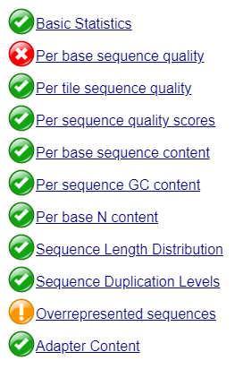
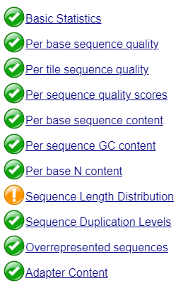
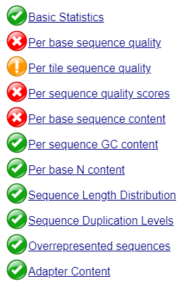
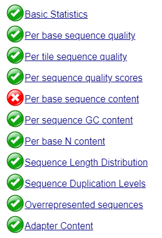
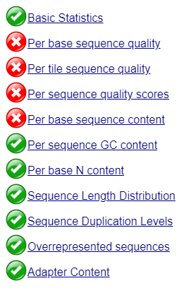
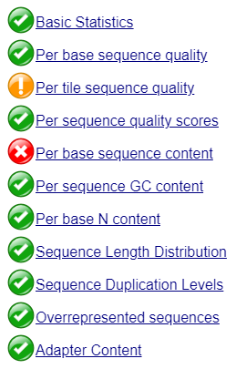
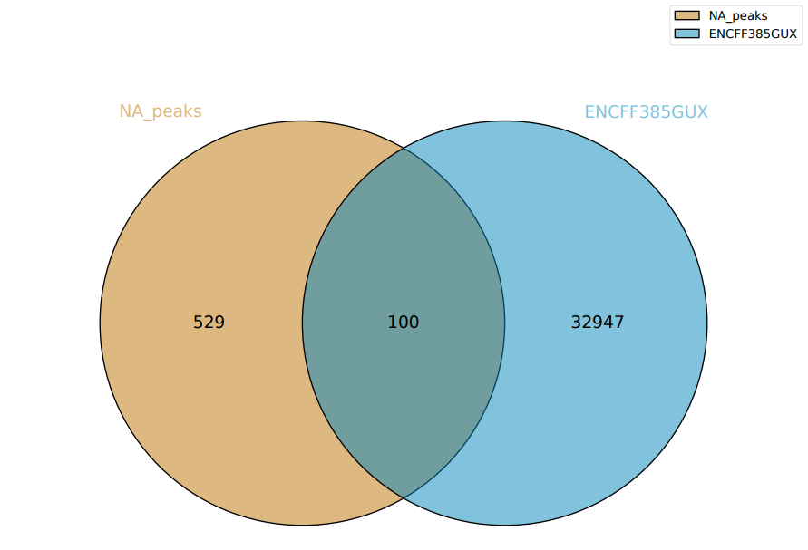
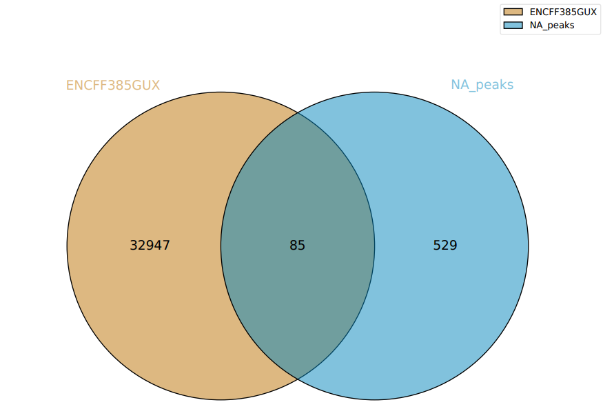
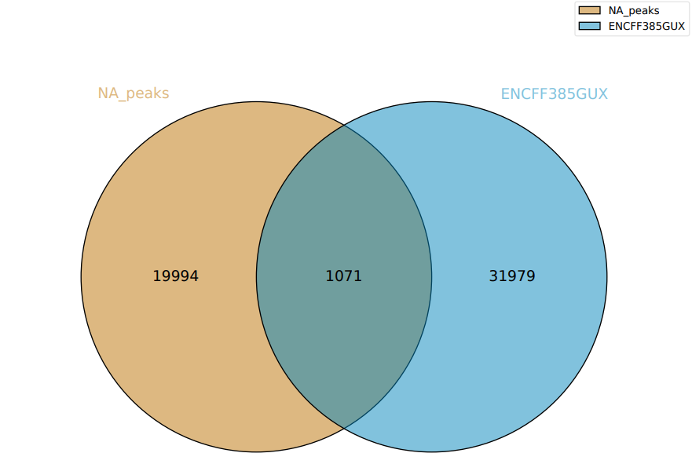

# Google Colab
### [Ссылка на ноутбук](https://colab.research.google.com/drive/10gGGKJr7OgpvJ8BloNNND797TrS-FWhi?usp=sharing)

# FastQC
Можно сделать вывод, что в каждом случае подрезание значительно улучшило характеристики.
## ENCFF278SGU
### [Ссылка от отчет до подрезания](fastqc/ENCFF278SGU_fastqc.html)
### [Ссылка от отчет после подрезания](fastqc/ENCFF278SGU_trimmed_fastqc.html)
Summary до подрезания:

Summary после подрезания:

## ENCFF367OLH
### [Ссылка от отчет до подрезания](fastqc/ENCFF367OLH_fastqc.html)
### [Ссылка от отчет после подрезания](fastqc/ENCFF367OLH_trimmed_fastqc.html)
Summary до подрезания:

Summary после подрезания:

## ENCFF969KKW
### [Ссылка от отчет до подрезания](fastqc/ENCFF969KKW_fastqc.html)
### [Ссылка от отчет после подрезания](fastqc/ENCFF969KKW_trimmed_fastqc.html)
Summary до подрезания:

Summary после подрезания:

# Выравнивание на хромосому 5
|                        |      total reads |   aligned 0 times | aligned exactly 1 time| aligned >1 times |
|------------------------|------------------|-------------------|-----------------------|------------------|
|ENCFF278SGU (реплика 1) |   35055488       | 28094377 (80.14%) | 1866036 (5.32%)        |5095075 (14.53%)  |
|ENCFF367OLH (реплика 2) |   33363869       | 29955291 (89.78%) | 1002075 (3.00%)       | 2406503 (7.21%)  |
|ENCFF969KKW (контроль)  |      56384154    | 51037733 (90.52%) | 1576025 (2.80%)       | 3770396 (6.69%) |

# Диаграммы Венна
Можно заметить, что т.к. выравнивание было на одну хромосому, то пиков вышло довольно мало, а соответственно и пересечений. В ENCODE в свою очередь пики присутствуют для всех хромосом.
## ENCFF367OLH

## ENCFF278SGU

